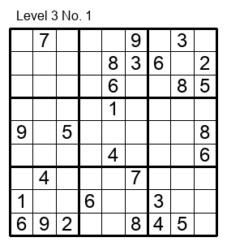

**Kaidoku** can solve [sudoku](rule) puzzles as shown in the figure, play with the puzzles and create sudoku puzzles with a command-line interface.

**Kaidoku** is a

* **player** of sudoku. You can play original sudoku puzzles of various level of difficulty with command line interface. You can get hints when you want.
* **solver** of sudoku. It can solve a sudoku puzzle and show the procedure of solving a sudoku puzzle with various logics. It evaluates if a given puzzle is valid sudoku with unique solution.
* **creater** of sudoku. It can create new sudoku puzzles. The puzzles shipped with this program was created by the program itself.

## Update

[Latest version](https://pypi.python.org/pypi/kaidoku) is **{{ site.version }}**

* 2017-11-05: Version 0.2.2 published.
* 2017-11-04: Version 0.2.0 published.
* 2017-10-28: Version 0.0.1 published.

## Document

Kaidoku is a program in development. Complete document is not available yet. Here document is written little by little.

- [How to install and get started](install)
- [Rule of sudoku](rule)
- [How to play with a sudoku puzzle](play)
- Getting hint on basic logic
- Select a problem of a specified difficulty level
- [Logics for solving sudoku puzzles used in this program](logic)
- Getting hint on advanced logics and showing candidates
- Bookmark management
- Play and analyze external sudoku problems
- Create new sudoku problems
- Managing configuration file
- [External sudoku sites](link)
