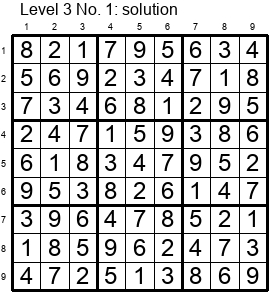

# Rule of sudoku

Sudoku, also called Number Place, is a logic-based numberplacement puzzle. A problem of sudoku puzzle is made of 9x9 grid with digits from 1 to 9 partially filled as in this image file.

Objective of the sudoku is to fill in the blank cells with numbers 1 to 9, so that each row, column, and box (3x3 subgrids) contains all of the digits from 1 to 9.

Solution of the above puzzle is like this.

Sudoku puzzle should have a unique solution.

# Variant

The above mentioned rule is a sudoku rule adopted in Kaidoku program. There are many variant of the rule. For detail, please refer to

- [Sudoku - Wikipedia](https://en.wikipedia.org/wiki/Sudoku)
- [Sudoku by nikoli](http://nikoli.co.jp/en/puzzles/sudoku.html)

[Home Page](./)
